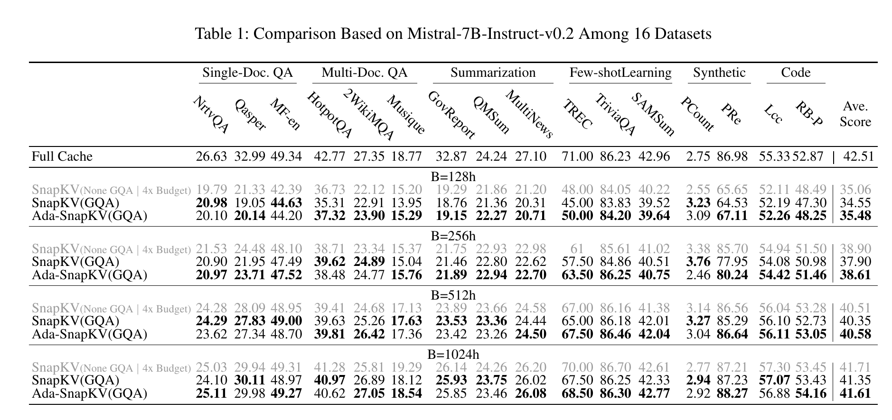
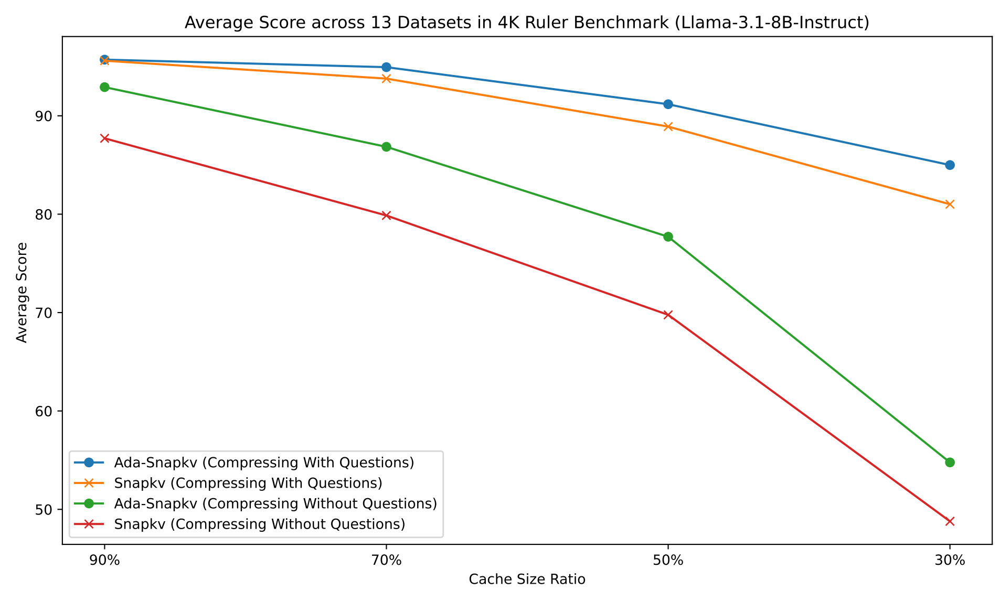
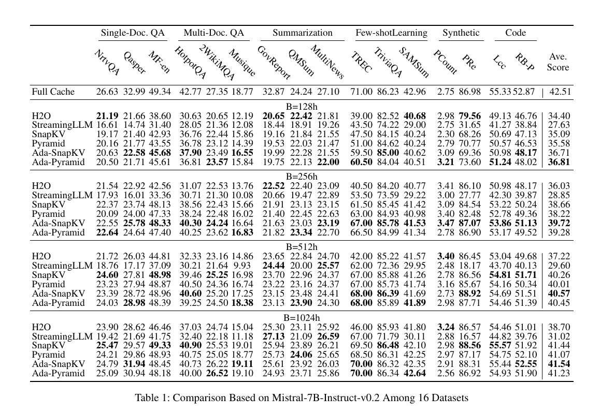

# AdaKV
Adaptive Budget Allocation across different attention heads based on their concentration degrees effectively improves budget utilization, thereby improving post-eviction generation quality.
<p align="center">
    
</p>
<!-- This example includes five KV cache elements with corresponding attention weights. Adaptive budget allocation, reallocating budgets from Head2/3 with sparse concentrations to the dispersed Head1, increases the aggregated weights of retained cache elements from 2.26 to 2.48 compared to Uniform Allocation. This adjustment closely correlates with a reduction in eviction loss.  -->

## Updates
* __[2024.11.08 GQA Support]__ In response to numerous community requests, we’ve just uploaded a new testing branch, named `test_gqa_support`, which introduces support for Grouped Query Attention (GQA) under the methods "SnapKV," "PyramidKV," "Ada-SnapKV," and "Ada-PyramidKV."  You can use the `GQA_eval_longbench.sh` script for direct evaluation on the LongBench benchmark. Detailed results will be released soon.
* __[2024.11.15 GQA Results]__ We have integrated GQA support for Mistral-7B-Instruct-v0.2 in SnapKV, PyramidKV, and our Ada-KV. You can try it by running the `GQA_eval_longbench.sh` script! Preliminary results on a single A800 are provided in the table below. In future updates, we will include more comprehensive GQA test results in the appendix of our [Ada-KV paper](arxiv.org/abs/2407.11550).

* __[2024.12.12 Community Collaboration ]__ We’re collaborating with NVIDIA’s [KVpress](https://github.com/NVIDIA/kvpress) team to integrate Ada-KV into their excellent project. This effort also aims to build a foundation for future research on head-specific cache compression methods. See the [draft PR](https://github.com/NVIDIA/kvpress/pull/25) for progress. Meanwhile, we’ve conducted broader evaluations of Ada-KV(Ada-SnapKV), including preliminary results on the 4K Ruler Benchmark (context compression with and without questions). For further insights into the evaluation, please refer to the kvpress [repository](https://github.com/NVIDIA/kvpress).


<p align="center">
     
</p>

## Usage

### Requirements

```
transformers==4.37.2
flash-attn==2.4.0

datasets
tiktoken
jieba
rouge_score
```

### Installation

```
git clone https://github.com/FFY0/AdaKV
cd AdaKV
make i
```

### Quick Start

```python
# replace modeling with adakv
from adaptive_snapkv.monkeypatch.monkeypatch import replace_mistral_adaptive, replace_llama_adaptive
replace_mistral_adaptive()
replace_llama_adaptive()

model = AutoModelForCausalLM.from_pretrained(
    model_name_or_path,
    config=config,
    device_map=device_map,
    attn_implementation="flash_attention_2",
    torch_dtype=torch.bfloat16,
    trust_remote_code=True,
)

# config hyperparameters
compress_args = {}
def config_compress(model, window_size=32, base_capacity=512, kernel_size=7, pooling="maxpool", floor_alpha=0.5, pyram_mode = False, beta = 20):
    model.model.config.window_size = window_size
    model.model.config.base_capacity = base_capacity
    model.model.config.kernel_size = kernel_size

    model.model.config.pooling = pooling
    model.model.config.floor_alpha = floor_alpha

    model.model.config.pyram_mode = pyram_mode
    model.model.config.pyram_beta = beta
    return model

model = config_compress(model, **compress_args)
```

#### Flattened Storage and Flash Attention Support

Considering varied cache length across heads, we implement a flattened storage layout of KV cache combined with `flash_attn_varlen_func` for efficent computation.

##### Regular MHA Cache Storage

```
Layer i:
    head0: (t00, t01, t02)
    head1: (t10, t11, t12)
    head2: (t20, t21, t22) 

past_key_value.update():

Layer i:
    head0: (t00, t01, t02, t03)
    head1: (t10, t11, t12, t13)
    head2: (t20, t21, t22, t23)

```

Note. `tij` means cache element of token j on head i in this case.

##### Flattened Cache Storage  

The corresponding cuda code can be found in [`./csrc/csrc/cuda_api.cu`](./csrc/csrc/cuda_api.cu).
```
Layer i:
    (t00, t01, t02, t03) (t10, t11) (t20, t21, t22)

past_key_value.update():

Layer i:
    phase 0: malloc empty cache
    (_, _, _, _, _) (_, _, _) (_, _, _, _)

    phase 1: copy old value
    (t00, t01, t02, t03, _) (t10, t11, _) (t20, t21, t22, _)
    
    phase 2: insert new value
    (t00, t01, t02, t03, t04) (t10, t11, t12) (t20, t21, t22, t23)
```

Details about flash_attn_varlen_func can be found in [`Repo`](https://github.com/Dao-AILab/flash-attention/blob/c4b9015d74bd9f638c6fd574482accf4bbbd4197/flash_attn/flash_attn_interface.py#L1051).

##### Peak Memory Footprint and Decoding Latency For Our Implementation:
<p align="center">
     
</p>

## Evaluations
### LongBench without GQA Support



```bash
cd ./experiments/LongBench
bash runall.sh
```


## Citation
If you found our work valuable, please cite:
```
@misc{feng2024adakvoptimizingkvcache,
      title={Ada-KV: Optimizing KV Cache Eviction by Adaptive Budget Allocation for Efficient LLM Inference}, 
      author={Yuan Feng and Junlin Lv and Yukun Cao and Xike Xie and S. Kevin Zhou},
      year={2024},
      eprint={2407.11550},
      archivePrefix={arXiv},
      primaryClass={cs.CL},
      url={https://arxiv.org/abs/2407.11550}, 
}
```

## Acknowledgement

We extend our gratitude to [SnapKV](https://github.com/FasterDecoding/SnapKV)  and [PyramidKV](https://github.com/Zefan-Cai/PyramidKV) for their contributions of open-source code, which have significantly facilitated the advancement of this project.

## Misc

### Observation

Different attention heads within each layer of LLMs exhibit significant disparities in the degrees of attention concentration. 

Therefore, we can improves budget utilization by dynamically allocating the budget across different attention heads within the same layer based on their concentration degrees.


