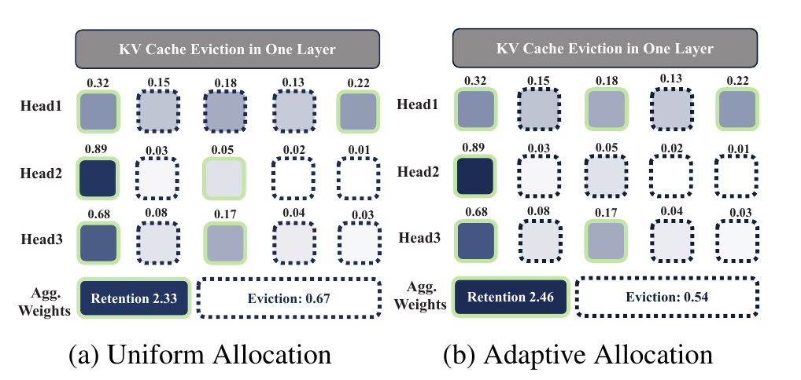
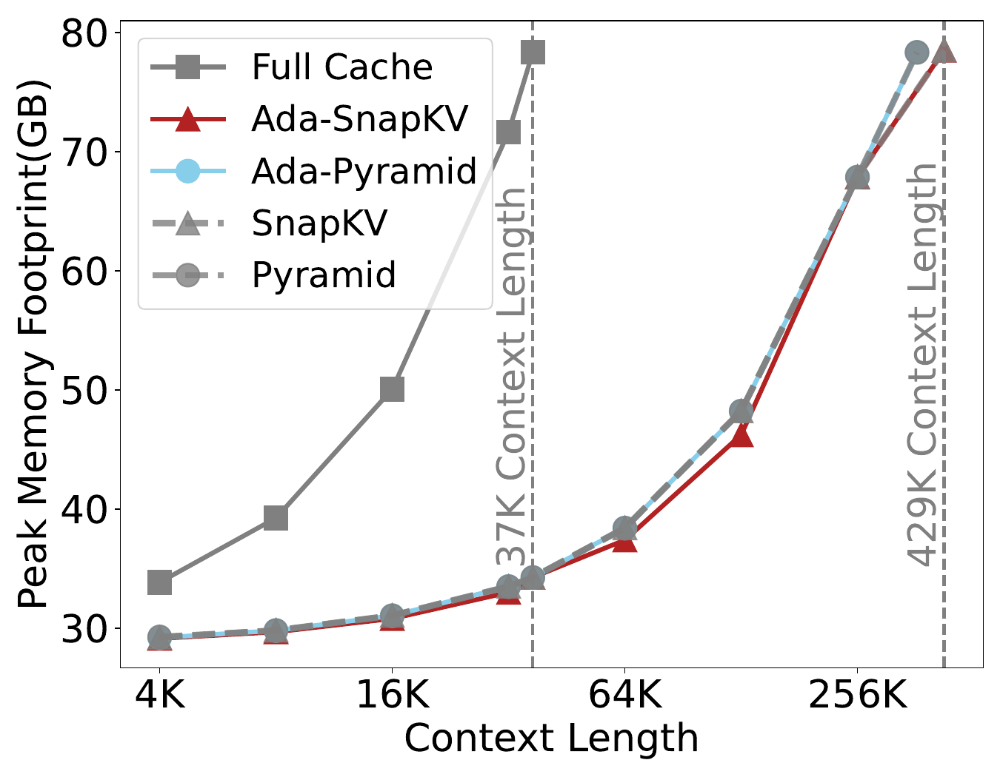
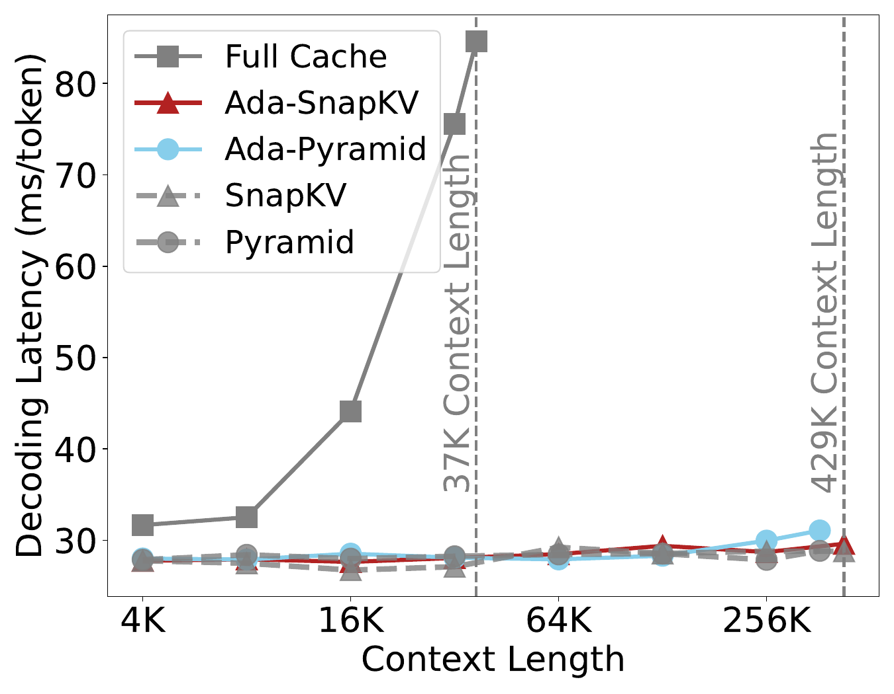
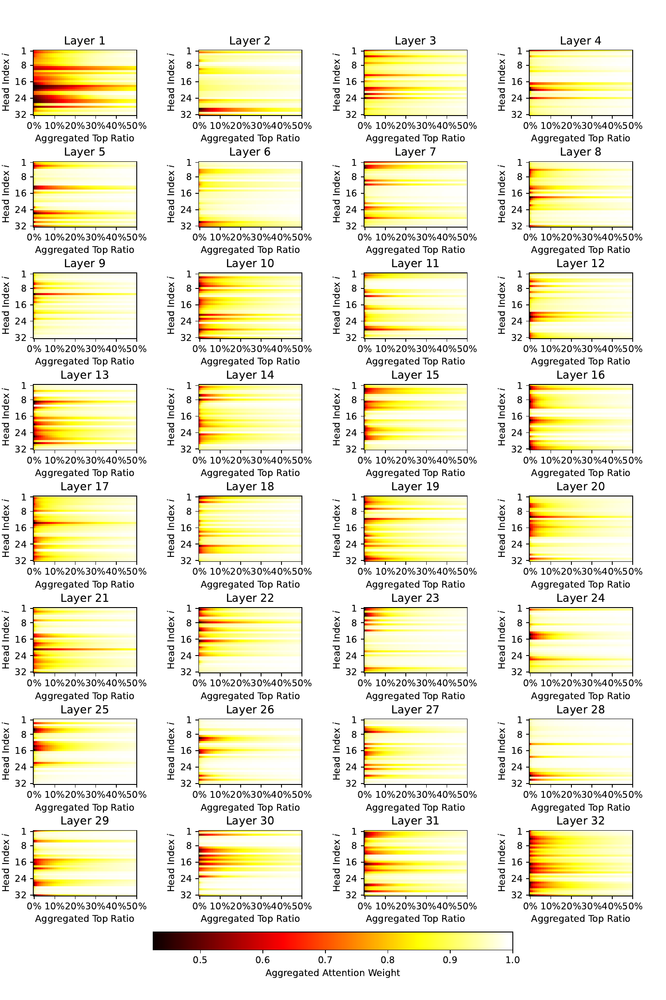

# AdaKV

AdaKV has been accepted at NeurIPS 2025! 🎉

<p align="center">
    
</p>
<!-- This example includes five KV cache elements with corresponding attention weights. Adaptive budget allocation, reallocating budgets from Head2/3 with sparse concentrations to the dispersed Head1, increases the aggregated weights of retained cache elements from 2.26 to 2.48 compared to Uniform Allocation. This adjustment closely correlates with a reduction in eviction loss.  -->

Adaptive budget allocation across attention heads (AdaKV) significantly improves budget utilization and post-eviction generation quality. As demonstrated below, integrating AdaKV into SnapKV and PyramidKV yields substantial gains on the sub-tasks of the Ruler Benchmark.


## Community Implementations of AdaKV

In addition to this AdaKV repository, we greatly appreciate the community’s engagement and acknowledge various community-driven implementations of AdaKV. Each offers unique advantages, and we hope these resources will also support your research:

* [NVIDIA/kvpress](https://github.com/NVIDIA/kvpress) NVIDIA’s open-source repository offers a hook-based, mask-driven head-wise allocation implementation, making further development easy. 
* [FFY/Ada-kvpress](https://github.com/FFY0/AdaKV-in-NVIDIA-kvpress/tree/AdaKV) This is my implementation of AdaKV based on the official Kvpress repository, featuring efficient head-wise allocation with custom CUDA kernels.
* [PyramidKV](https://github.com/Zefan-Cai/KVCache-Factory) The official PyramidKV repository integrates a wide range of KV cache eviction methods and provides comprehensive evaluations on existing benchmarks.
* [kvcompress](https://github.com/IsaacRe/vllm-kvcompress) The Cloudflare team integrates Ada-KV into vLLM—an impressive and cool example of industrial deployment.
* [Sparse Frontier](https://github.com/PiotrNawrot/sparse-frontier) The latest repository with elegant vLLM integration leverages Triton kernels to efficiently implement AdaKV and various other sparse methods.

## Broad Works Benefiting from AdaKV
Many cutting-edge methods have integrated the Adaptive Budget Allocation of AdaKV for further enhancement. Below are several successful cases for reference (please feel free to suggest any additions we may have missed):

* Identify Critical KV Cache in LLM Inference from an Output Perturbation Perspective [paper](https://arxiv.org/abs/2502.03805),[code](https://github.com/FFY0/AdaKV-in-NVIDIA-kvpress/tree/criticalkv)
* ExpectedAttention [A KV compress methods proposed by NIVIDA kvpress team](https://github.com/NVIDIA/kvpress/)
* Not All Heads Matter: A Head-Level KV Cache Compression Method with Integrated Retrieval and Reasoning [paper](https://arxiv.org/abs/2410.19258), [code](https://github.com/FYYFU/HeadKV/)
* KVzip: Query-Agnostic KV Cache Compression with Context Reconstruction [paper](https://arxiv.org/abs/2505.23416)
* SparseMM: Head Sparsity Emerges from Visual Concept Responses in MLLMs [paper](https://arxiv.org/pdf/2506.05344),[code](https://github.com/CR400AF-A/SparseMM)
* The Sparse Frontier: Sparse Attention Trade-offs in Transformer LLMs [paper](https://arxiv.org/pdf/2504.17768), [code](https://github.com/PiotrNawrot/sparse-frontier)
* KV-Compress: Paged KV-Cache Compression with Variable Compression Rates per Attention Head [paper](https://arxiv.org/abs/2410.00161), [code](https://arxiv.org/abs/2410.00161)
* Draft-based Approximate Inference for LLMs [paper](https://arxiv.org/pdf/2506.08373), [code](https://github.com/furiosa-ai/draft-based-approx-llm)


## Usage of this Repo

### Requirements

```
transformers==4.44.2
flash-attn==2.4.0

datasets
tiktoken
jieba
rouge_score
```

### Installation

```
git clone https://github.com/FFY0/AdaKV
cd AdaKV
make i
```

### Quick Start

```python
# replace modeling with adakv
from adaptive_snapkv.monkeypatch.monkeypatch import replace_mistral_adaptive, replace_llama_adaptive
replace_mistral_adaptive()
replace_llama_adaptive()

model = AutoModelForCausalLM.from_pretrained(
    model_name_or_path,
    config=config,
    device_map=device_map,
    attn_implementation="flash_attention_2",
    torch_dtype=torch.bfloat16,
    trust_remote_code=True,
)

# config hyperparameters
compress_args = {}
def config_compress(model, window_size=32, base_capacity=512, kernel_size=7, pooling="maxpool", floor_alpha=0.5, pyram_mode = False, beta = 20):
    model.model.config.window_size = window_size
    model.model.config.base_capacity = base_capacity
    model.model.config.kernel_size = kernel_size

    model.model.config.pooling = pooling
    model.model.config.floor_alpha = floor_alpha

    model.model.config.pyram_mode = pyram_mode
    model.model.config.pyram_beta = beta
    return model

model = config_compress(model, **compress_args)
```

#### Flattened Storage and Flash Attention Support

Considering varied cache length across heads, we implement a flattened storage layout of KV cache combined with `flash_attn_varlen_func` for efficent computation.

##### Regular MHA Cache Storage

```
Layer i:
    head0: (t00, t01, t02)
    head1: (t10, t11, t12)
    head2: (t20, t21, t22) 

past_key_value.update():

Layer i:
    head0: (t00, t01, t02, t03)
    head1: (t10, t11, t12, t13)
    head2: (t20, t21, t22, t23)

```

Note. `tij` means cache element of token j on head i in this case.

##### Flattened Cache Storage  

The corresponding cuda code can be found in [`./csrc/csrc/cuda_api.cu`](./csrc/csrc/cuda_api.cu).
```
Layer i:
    (t00, t01, t02, t03) (t10, t11) (t20, t21, t22)

past_key_value.update():

Layer i:
    phase 0: malloc empty cache
    (_, _, _, _, _) (_, _, _) (_, _, _, _)

    phase 1: copy old value
    (t00, t01, t02, t03, _) (t10, t11, _) (t20, t21, t22, _)
    
    phase 2: insert new value
    (t00, t01, t02, t03, t04) (t10, t11, t12) (t20, t21, t22, t23)
```

Details about flash_attn_varlen_func can be found in [`Repo`](https://github.com/Dao-AILab/flash-attention/blob/c4b9015d74bd9f638c6fd574482accf4bbbd4197/flash_attn/flash_attn_interface.py#L1051).

##### Peak Memory Footprint and Decoding Latency For Our Implementation:
<p align="center">
     
</p>

## Citation
If you find this repo useful for your research, please kindly cite using this BibTeX:
```
@article{feng2024ada,
  title={Ada-kv: Optimizing kv cache eviction by adaptive budget allocation for efficient llm inference},
  author={Feng, Yuan and Lv, Junlin and Cao, Yukun and Xie, Xike and Zhou, S Kevin},
  journal={arXiv preprint arXiv:2407.11550},
  year={2024}
}

@article{feng2025identify,
  title={Identify Critical KV Cache in LLM Inference from an Output Perturbation Perspective},
  author={Feng, Yuan and Lv, Junlin and Cao, Yukun and Xie, Xike and Zhou, S Kevin},
  journal={arXiv preprint arXiv:2502.03805},
  year={2025}
}
```


## Acknowledgement

We extend our gratitude to [SnapKV](https://github.com/FasterDecoding/SnapKV)  and [PyramidKV](https://github.com/Zefan-Cai/PyramidKV) for their contributions of open-source code, which have significantly facilitated the advancement of this project. We also thank the entire community for their interest in AdaKV and for their support, which has helped us go even further.

<!-- ## Misc

%### Observation

%Different attention heads within each layer of LLMs exhibit significant disparities in the degrees of attention concentration. 

%Therefore, we can improves budget utilization by dynamically allocating the budget across different attention heads within the same %layer based on their concentration degrees.

% -->
